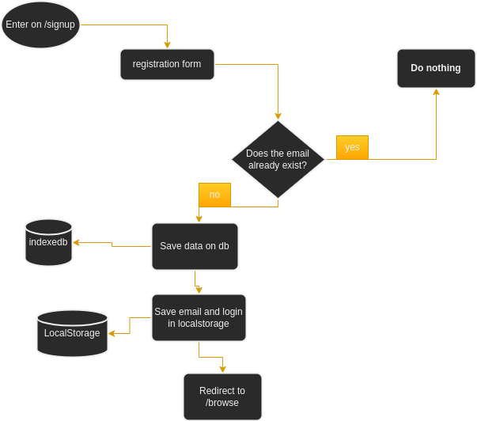
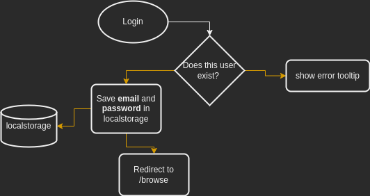
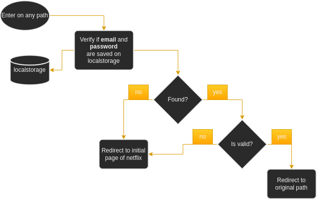

# Authentication

I used a mix of indexedb with localstorage to authenticate. This applied to vue's router-guards results in a very simple and powerful way to make a login system.

## Registration

1. When a user registers in the application, a new document with his data is inserted in the indexedb.
2. If the email he entered already exists, the application will do nothing.
3. If the registration is successful, the user will be redirected to the movie catalog screen.
:::info
your email/password details will be saved in localStorage for auto-login.
:::

## Login

When the user fills in the login form, if all the data is correct, it will be saved in localstorage and the user will be redirected to /browse

## Auto-login

Whenever the user reloads the page, the router will fetch the elements saved in localStorage, fill in the Login store and continue the flow.

If there is no data in the localstorage, or the data is invalid, it will be removed and the user will be redirected to netflix home screen

## Logout

The app's store login will be fully reset, and the login and password will be removed from localstorage.
