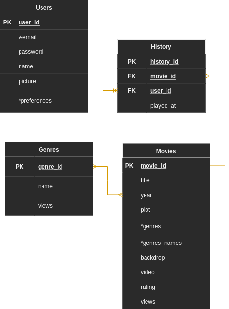

# Indexedb Database With Dexie

:::warning
The diagram exemplifies a relational database, so it is not fully interoperable with indexedb, which is more like a document-type database.

Regardless, it's a good starting point for explaining how I've linked the documents in indexedb.
:::

## ER database modeling

- Fields with '*'' are multivalued fields. indexed allows indexing by lists of values.
- Fields with '&' are unique fields. It is similar to **unique** from sql schema.

:::tip
The views field is better explained in [metrics](./metrics.md).
:::
